# Гайдик с комментариями для создания приложения с подключаемой кастомной DLL

## Что нужно иметь
* [Visual Studio](https://visualstudio.microsoft.com/downloads/)
* Выбран Desktop development with C++ во время установки
* Две руки

## Создаем проект для DLL
1. Запускаем Visual Studio, он нас приветствует и спрашивает чего же мы хотим сделать сегодня. Мы хотим новый проект

    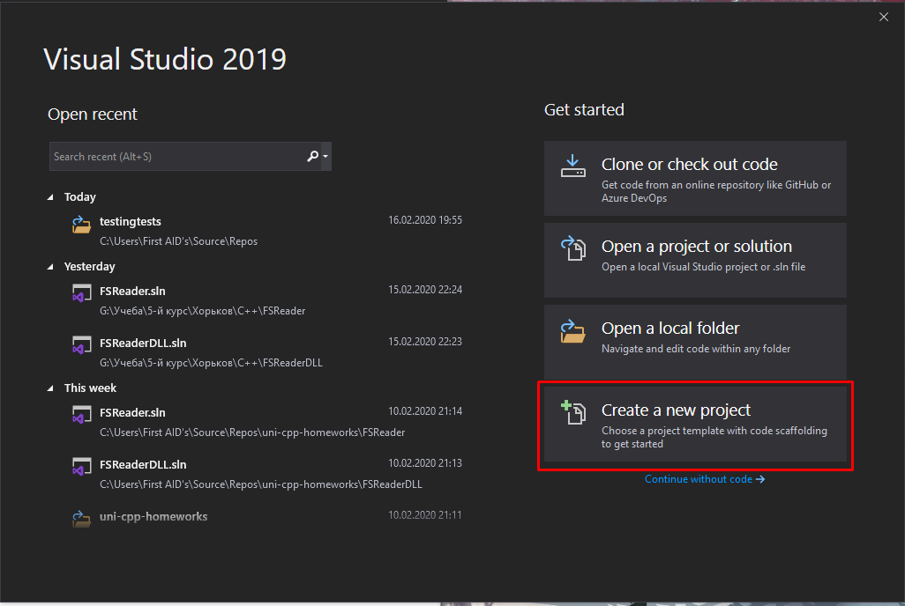
    
2. В мастере создания новых проектов выбираем DLL

    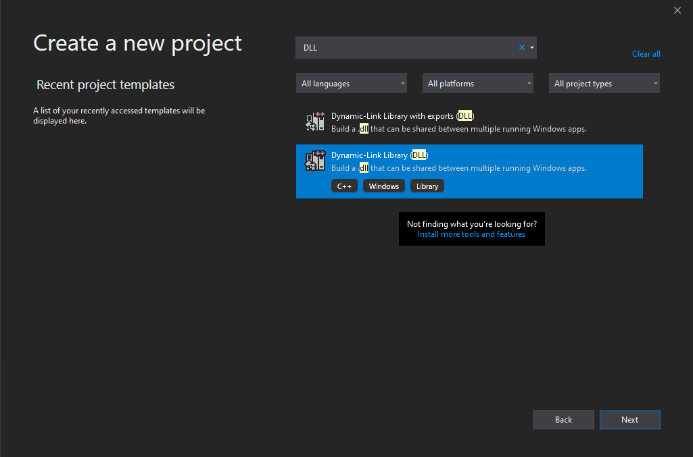
    
3. Поскольку мы опираемся на официальный [гайд с MSDN](https://docs.microsoft.com/en-us/cpp/build/walkthrough-creating-and-using-a-dynamic-link-library-cpp?view=vs-2019#create-the-dll-project), мы называем проект `MathLibrary`, настройки оставляем как на скрине, чтобы дальше не надо было извращаться с путями к файлам 

    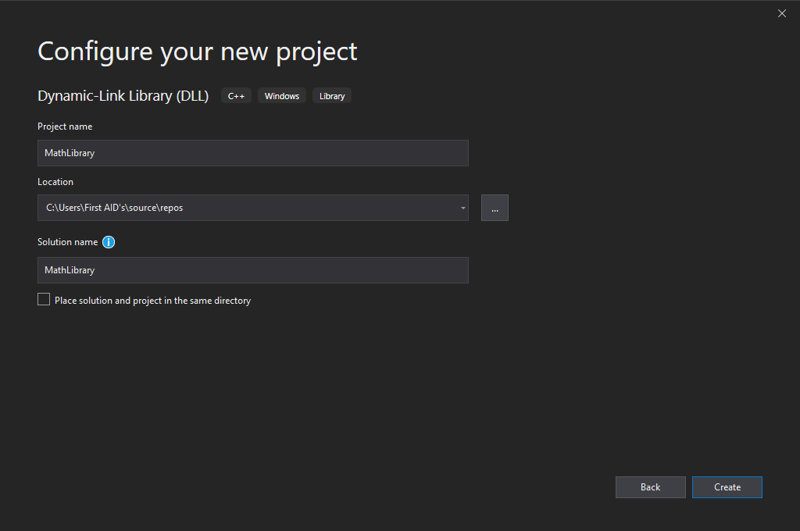

4. После создания проекта добавляем заголовочный файл `MathLibrary.h` 

    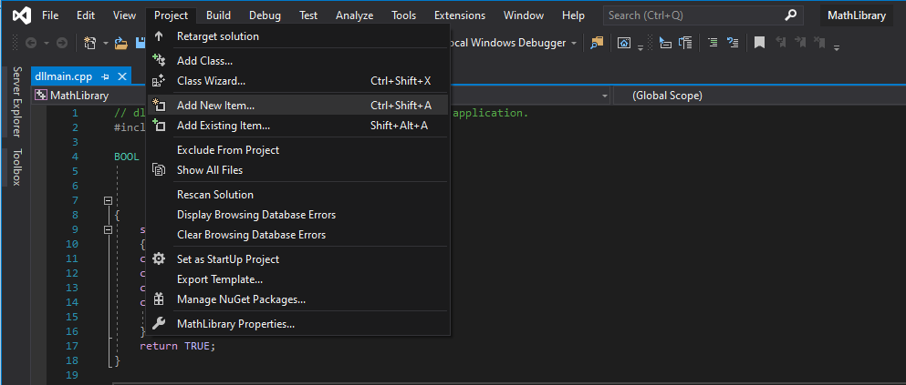 

    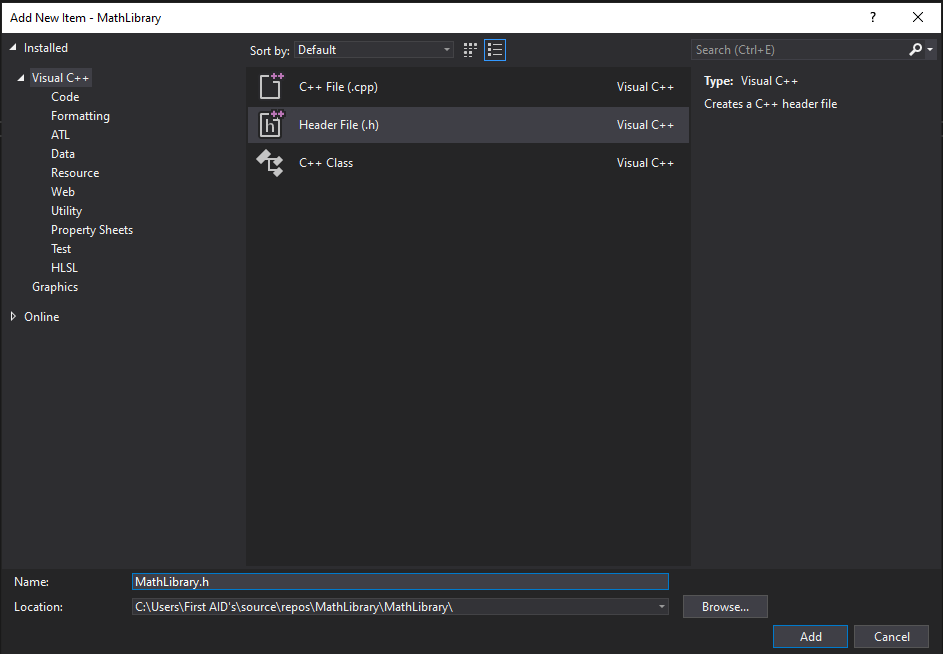 
    
5. Копируем туда код 
```c++
// MathLibrary.h - Contains declarations of math functions
#pragma once

#ifdef MATHLIBRARY_EXPORTS
#define MATHLIBRARY_API __declspec(dllexport)
#else
#define MATHLIBRARY_API __declspec(dllimport)
#endif

// The Fibonacci recurrence relation describes a sequence F
// where F(n) is { n = 0, a
//               { n = 1, b
//               { n > 1, F(n-2) + F(n-1)
// for some initial integral values a and b.
// If the sequence is initialized F(0) = 1, F(1) = 1,
// then this relation produces the well-known Fibonacci
// sequence: 1, 1, 2, 3, 5, 8, 13, 21, 34, ...

// Initialize a Fibonacci relation sequence
// such that F(0) = a, F(1) = b.
// This function must be called before any other function.
extern "C" MATHLIBRARY_API void fibonacci_init(
    const unsigned long long a, const unsigned long long b);

// Produce the next value in the sequence.
// Returns true on success and updates current value and index;
// false on overflow, leaves current value and index unchanged.
extern "C" MATHLIBRARY_API bool fibonacci_next();

// Get the current value in the sequence.
extern "C" MATHLIBRARY_API unsigned long long fibonacci_current();

// Get the position of the current value in the sequence.
extern "C" MATHLIBRARY_API unsigned fibonacci_index();
```
6. Теперь добавим имплементацию. Создаем новый файл `MathLibrary.cpp` и заполняем его кодом

    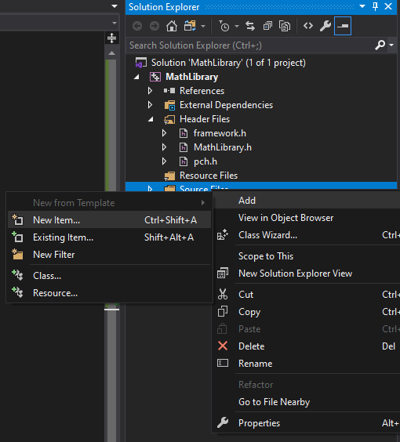 

    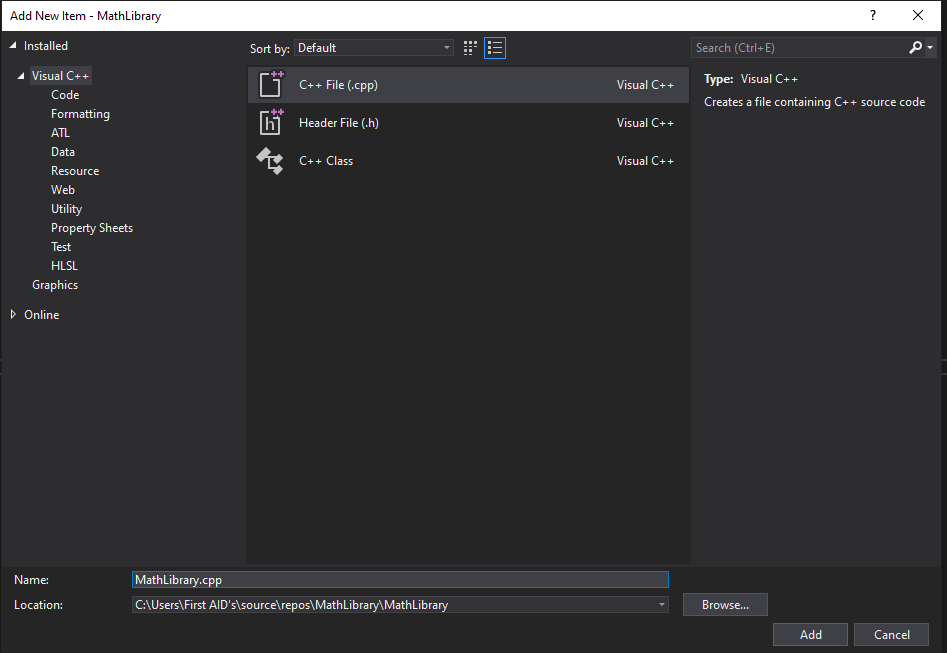 
    
```
// MathLibrary.cpp : Defines the exported functions for the DLL.
#include "pch.h" // use stdafx.h in Visual Studio 2017 and earlier
#include <utility>
#include <limits.h>
#include "MathLibrary.h"

// DLL internal state variables:
static unsigned long long previous_;  // Previous value, if any
static unsigned long long current_;   // Current sequence value
static unsigned index_;               // Current seq. position

// Initialize a Fibonacci relation sequence
// such that F(0) = a, F(1) = b.
// This function must be called before any other function.
void fibonacci_init(
    const unsigned long long a,
    const unsigned long long b)
{
    index_ = 0;
    current_ = a;
    previous_ = b; // see special case when initialized
}

// Produce the next value in the sequence.
// Returns true on success, false on overflow.
bool fibonacci_next()
{
    // check to see if we'd overflow result or position
    if ((ULLONG_MAX - previous_ < current_) ||
        (UINT_MAX == index_))
    {
        return false;
    }

    // Special case when index == 0, just return b value
    if (index_ > 0)
    {
        // otherwise, calculate next sequence value
        previous_ += current_;
    }
    std::swap(current_, previous_);
    ++index_;
    return true;
}

// Get the current value in the sequence.
unsigned long long fibonacci_current()
{
    return current_;
}

// Get the current index position in the sequence.
unsigned fibonacci_index()
{
    return index_;
}
```
7. Чтобы удостовериться, что все работает, соберем нашу DLL. Жмем **Build** > **Build Solution**

    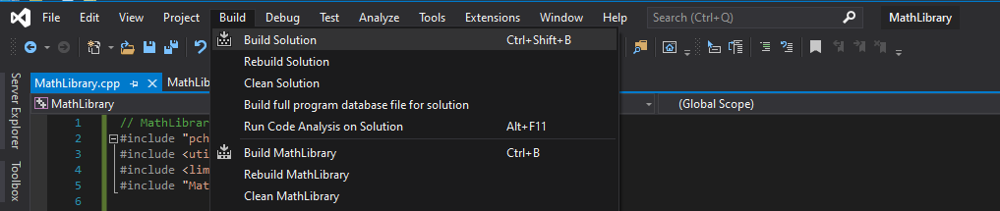 

    Если все хорошо, то увидим, что проект успешно собрался

    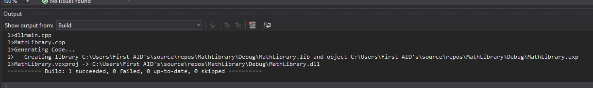 

## Создаем клиентское приложение, использующее DLL

Иметь DLL, конечно, круто, но она, сама по себе, ничего не делает. Забахаем терминальное приложение

1. Жмакаем **File** > **New** > **Project**

2. В открывшемся окне выбираем *Console App* и называем его `MathClient`, все остальное оставляем так же, как в первый раз

    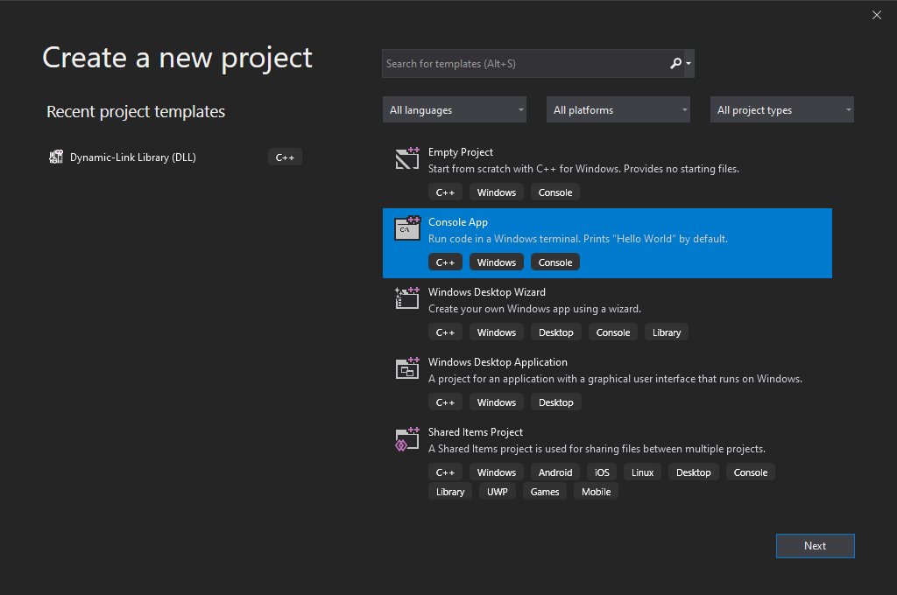

3. Жакаем ПКМ на проект и выбираем *Properties* 

    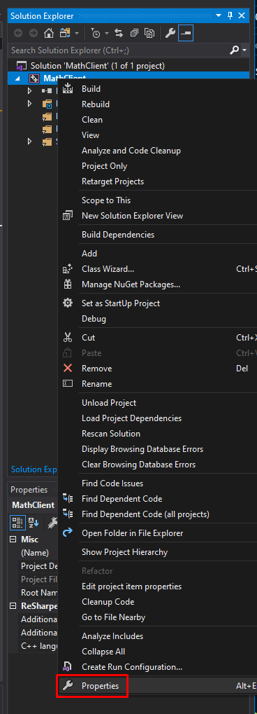

4. Смотрим, что выбрано **All Configurations** и проваливаемся в **Configuration Properties** > **C/C++** > **General**, где жмакаем в **Additional Include Directories** и выбираем  **Edit** 
    
    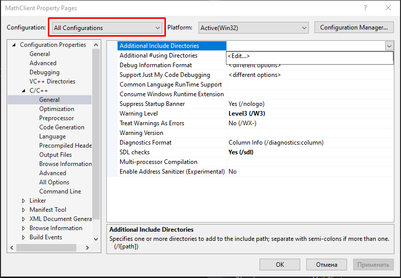

5. Двойным щелчком в **Additional Include Directories** или нажатием на иконку каталога добавляем   запись. Если все делали по инструкции, то добавляем туда запись `..\..\MathLibrary\MathLibrary`
   Если нет, то ~~страдаем~~ вводим относительный путь до папки, в которой лежит DLL (можно абсолютный, но ~~это путь ламеров~~ тогда проект становиться не мобильным).
   
   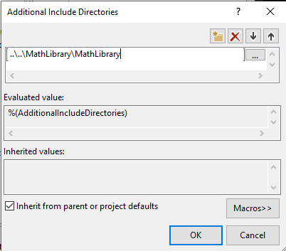

6. Заменяем код в **MathLibrary.h** на следующий 

   ```
   // MathClient.cpp : Client app for MathLibrary DLL.
   // #include "pch.h" Uncomment for Visual Studio 2017 and earlier
   #include <iostream>
   #include "MathLibrary.h"
   
   int main()
   {
       // Initialize a Fibonacci relation sequence.
       fibonacci_init(1, 1);
       // Write out the sequence values until overflow.
       do {
           std::cout << fibonacci_index() << ": "
               << fibonacci_current() << std::endl;
       } while (fibonacci_next());
       // Report count of values written before overflow.
       std::cout << fibonacci_index() + 1 <<
           " Fibonacci sequence values fit in an " <<
           "unsigned 64-bit integer." << std::endl;
   }
   ```
    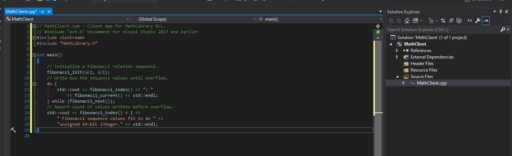

7. Снова открываем **Properties** проекта, проваливаемся в **Linker** > **Input** и в **Additional Dependencies** выбираем **Edit** 

    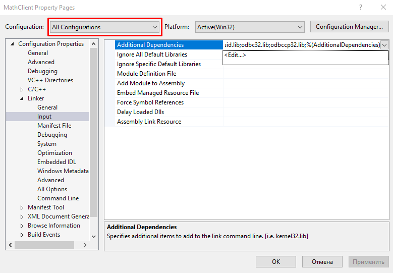

8. Добавляем туда *MathLibrary.lib*

    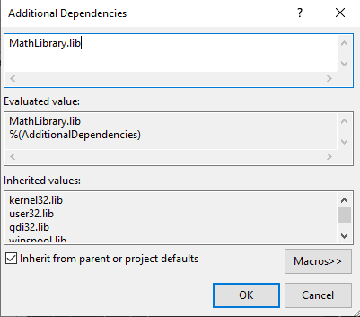

9. Теперь проваливаемся в **Linker** > **General** и в **Additional Library Directories** выбираем **Edit** 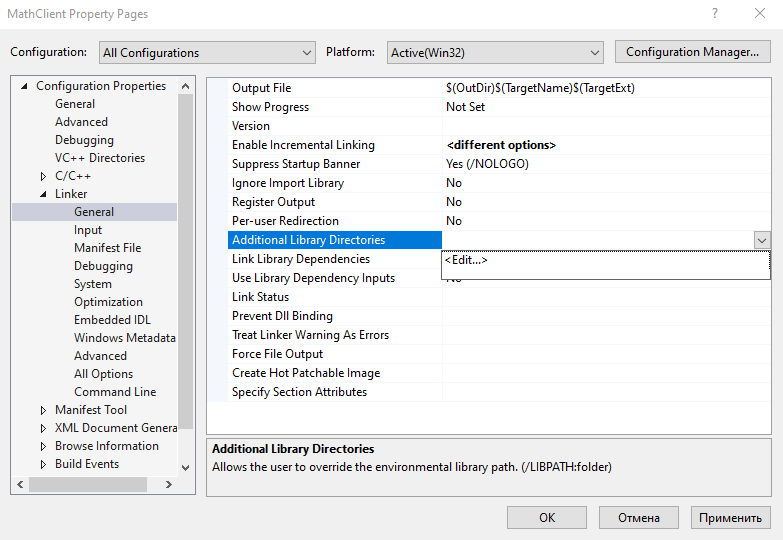

10. Та же история, что и раньше, двойное нажатие и указываем относительный путь `..\..\MathLibrary\$(IntDir)`
    
    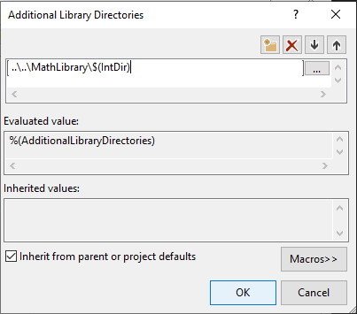

11.  Проваливаемся в **Build Events** > **Post-Build Event** и в **Command Line** выбираем **Edit**     
    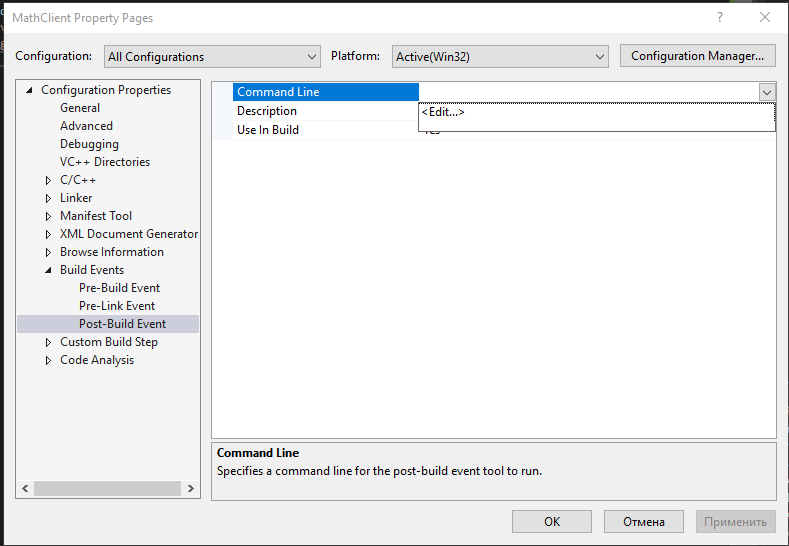

12. Вводим туда команду, которая будет копировать наш DLL в папку со скомпилированным .exe 

    ```
    xcopy /y /d "..\..\MathLibrary\$(IntDir)MathLibrary.dll" "$(OutDir)"
    ```

    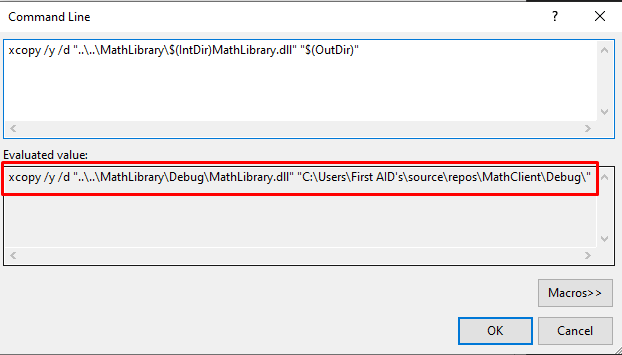
    И убеждаемся, что в **Evaluated value** у нас что-то похожее на правду

13. Жмем **Build** > **Build Solution** и ~~молимся~~ смотрим в **Output**, что наш проект успешно собрался
    
    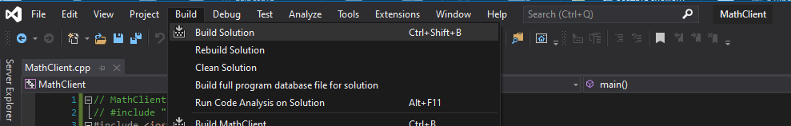

    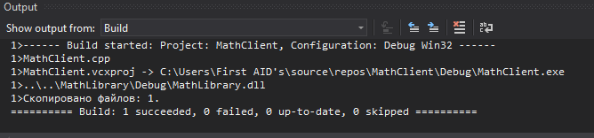

14. Запускам приложение **Debug** > **Start Without Debugging** 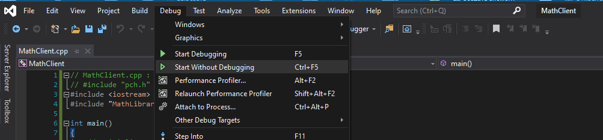

    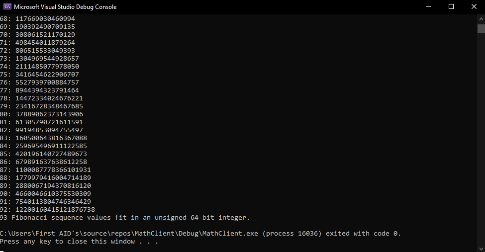

???

PROFIT

## Пост скриптум

Как вы уже могли заметить, это в некоторых местах сжатый, а в некоторых расширенный "перевод" [гайда с MSDN](https://docs.microsoft.com/en-us/cpp/build/walkthrough-creating-and-using-a-dynamic-link-library-cpp?view=vs-2019). Если хочется со всем этим делом разобраться - лучше читать первоисточник. Но, если просто следовать этим инструкциям, а вместо кода из примера подставить свой для чтения FS, все тоже замечательно сработает. Главное, не забывайте перекомпилировать DLL, когда вносите в нее изменения ~~не будьте как я~~


