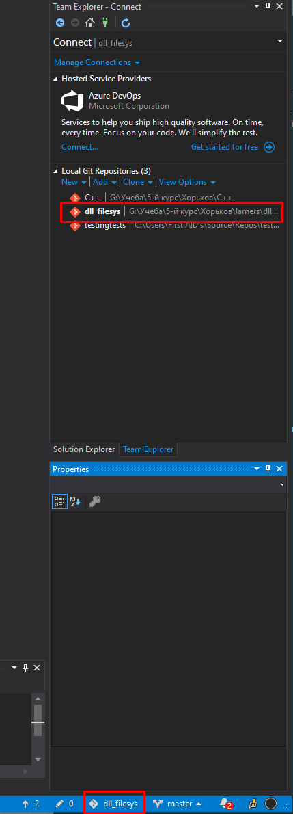
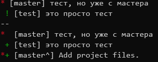
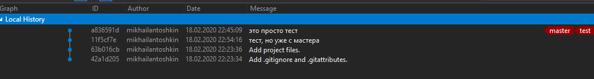

# HOWTO ветки и слияния в гит
## ДИСКЛЕЙМОР
* Если не лень, прочитайте [вот эту статью](https://git-scm.com/book/ru/v2/%D0%92%D0%B5%D1%82%D0%B2%D0%BB%D0%B5%D0%BD%D0%B8%D0%B5-%D0%B2-Git-%D0%9E%D1%81%D0%BD%D0%BE%D0%B2%D1%8B-%D0%B2%D0%B5%D1%82%D0%B2%D0%BB%D0%B5%D0%BD%D0%B8%D1%8F-%D0%B8-%D1%81%D0%BB%D0%B8%D1%8F%D0%BD%D0%B8%D1%8F) или вообще [всю книгу в целом](https://git-scm.com/book/ru/v2) 
* Работать будем с GUI в VS, в разных GUI будет по разному, но, примерно одинаково
* То, что здесь описано не является истиной в первой инстанции, а просто, в некотором роде, правило хорошего тона при работе с git в распределенных команадах. 
* Установка git и настройка взаимодействия его с VS опущена
* Интерфейс у VS сильно перегружен, на мой вкус, так что ~~страдайте~~ придется разбираться
* Работает сугубо локально, с remote/origin как-нибудь потом

Приступим

### Добавляем что-то в git
Если проект не был добавлен в git руками - это можно сделать через  VS. Открываем проект и видим внизу промпт 

Жмакнув на него и выбрав git (если он, конечно, установлен), мы добавили проект в репозиторий. Теперь жмем на имя файла, у нас откроется Team Explorer

Двойным щелчком переходим на нужный нам репозиторий и попадаем в Home этого репозитория. Здесь нажимая на Solution Explorer можно переключиться в привычный вид проекта. В данном случае нас будут инетерсовать разделы **Changes** и **Branches** 

    
Начальное состояние репозитория VS нам коммитит сам. Глянем. Заходим в Branches, ПКМ на ветку master и View History

Создадим новую ветку. ПКМ на ветку master и New Local Branch From. Вверху появиться поле для ввода имени ветки, вводим необходимое и подтверждаем

У нас создалась новая ветка. Переключиться на нее можно либо через ПКМ -> Checkout или выбрав внизу из списка

 

Внесем какие-нибудь изменения. Переключаемся в **Solution Explorer**, выбираем случайный файл и что-нибудь в него допишем

Переключаемся обратно в **Team Explorer** и возвращаемся назад в Home 

Переходим в раздел Changes и видим измененный нами файл. Пишем сообщение коммита и коммитим изменения

Возвращаемся обратно в Branches и смотрим историю нашей ветки. GUI любезно нам подсказывает, что наша ветка опережает мастер на один коммит

Переключаемся на мастер. ПКМ -> Checkout. Так же поменяем какой-нибудь файл. Я буду менять этот же файл, чтобы показать как можно работать, когда несколько человек изменяют один и тот же файл и периодически синхронизируют свою работу через одну общую ветку. Переключаемся в **Solution Explorer**, вносим изменения в другую часть файла

Переключаемся обратно в **Team Explorer** и переходим в раздел Changes, вводим сообщения коммита и коммитим

Я не разобрался как тут смотреть сразу историю сразу нескольких веток, поэтому скрин из терминала. Идея в том, что у нас теперь мастер впереди теста на 1 коммит

### Для общего развития, это не то, что требудется в задании напрямую

Теперь правило хорошего тона при работе с ветками. Перед мерджем/пулл реквестом нужно сделать ребейз изменений с ветки, в которую вы будете мерджит/создавать пулл реквест. Это нужно для того, что если у вас и возникнут конфликты, вы решали их локально в своей ветке и не портили жизнь другим. Правило не обязательное к выполнению, но желательное, чтобы потом ~~синьор не разрешал конфликты и переписывал историю~~ не было головной боли. 

Переключаемся на ту ветку, которую мы будем мерджить (в нашем случае test) и жмем Rebase. В Onto выбираем ветку, в которую мы в последствии собираемся мерджить, жмем Rebase

Git, будучи умной софтиной, применяет все изменения к нам в ветку и ставит наши коммиты вперед тех коммитов, что пришли с ветки, на которую мы делали Rebase, что, собственно, видно в истории ветки

Время мерджить. Переключаемся на мастера, жмем ПКМ на test и выбираем Merge From. Смотрим, что правильно выбрано откуда и куда мы будем мерджить. ~~закрыв глаза~~ Жмем мердж

Получаем красивую линейную историю, с которой удобно работать, но от нас требуют не этого, так что сделаем то, чего от нас хотят

### Что нужно непосредственно в задании

Приводим обратно в состояние рассинхрона, на этот раз коммитим разные файлы. Я нашел комманду, которая выводит это дело покрасивше ~~скрины переделывать не буду, сорян~~

Теперь не делаем ребейз, а просто переключаемся на мастер и делаем мерджим ветку. Т.к. мы меняли разные файлы, у нас не будет мердж конфликтов и мы получим вот такую историю коммитов

## А зачем нужно было про Rebase
Если мерджить через пулл реквест на том же гитхабе, например, он начнет плеваться в тебя, \<username\>, мердж конфликтами при открытом пулл реквесте. Зачем тебе захламлять пулл реквест разрешением конфликтов, если это можно сделать тихонечко в себя в IDE и не тревожить человека, который будет делать ревью. Если это пулл реквест через веб, то он все равно сохраняет историю "с отвлетвлениями". Вот так должна выглядеть история ~~нормального~~ develop

